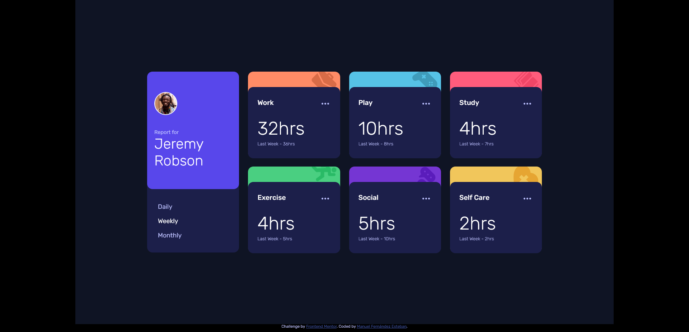

# Frontend Mentor - Time tracking dashboard solution

This is a solution to the [Time tracking dashboard challenge on Frontend Mentor](https://www.frontendmentor.io/challenges/time-tracking-dashboard-UIQ7167Jw). Frontend Mentor challenges help you improve your coding skills by building realistic projects. 

## Table of contents

- [Overview](#overview)
  - [The challenge](#the-challenge)
  - [Screenshot](#screenshot)
  - [Links](#links)
- [My process](#my-process)
  - [Built with](#built-with)
  - [What I learned](#what-i-learned)
  - [Continued development](#continued-development)
- [Author](#author)

## Overview

### The challenge

Users should be able to:

- View the optimal layout for the site depending on their device's screen size
- See hover states for all interactive elements on the page
- Switch between viewing Daily, Weekly, and Monthly stats

### Screenshot

### Links

- Solution URL: [GitHub](https://github.com/ManuelFernandezEsteban/timeTrackingDashBoard.git)
- Live Site URL: [GitHubPages](https://manuelfernandezesteban.github.io/timeTrackingDashBoard/)

## My process

### Built with

- Semantic HTML5 markup
- CSS custom properties
- Flexbox
- CSS Grid
- Mobile-first workflow

### What I learned

I have learned the use of fetch with async and await

async function getData (direccion){

    const response = await fetch(direccion);
    const data = await response.json();
    return data;
}

## Author

- Frontend Mentor - [@ManuelFernandezEsteban](https://www.frontendmentor.io/profile/ManuelFernandezEsteban)
- linkedIn - [LinkedIn](www.linkedin.com/in/manuel-fernandez-esteban)